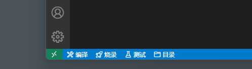
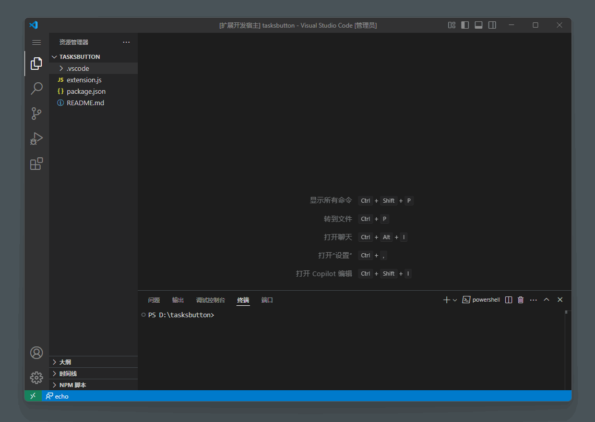
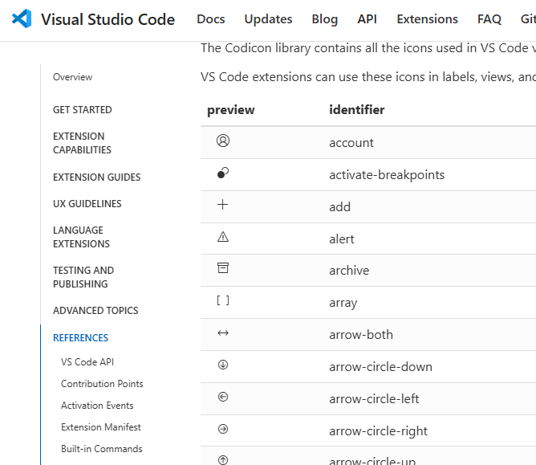

# Tasks Button

`Tasks Button`，为你的 `Tasks` 添加 `Button` !

## 功能介绍

为 VS Code 的状态栏添加自定义按钮，让你能快速运行在 `.vscode/tasks.json` 中定义的任务，无需通过命令面板查找。



## 使用方法

1. 确保你的项目中有 `.vscode/tasks.json` 文件并定义了任务
2. 在 VS Code 设置文件 `settings.json` 中配置你想要显示的任务按钮



## 配置示例

假设你的 `.vscode/tasks.json` 如下：

```
{
    "version": "2.0.0",
    "tasks": [
        {
            "label": "echo",
            "type": "shell",
            "command": "echo Hello",
        },
        {
            "label": "dirtest",
            "type": "shell",
            "command": "dir",
        }
    ]
}
```

那么可以在 `settings.json` 中进行这样的配置：

```json
{
    "tasksButton.tasks": [
        {
            "name": "echo",         // 按钮显示的名称
            "label": "echo",        // 对应 tasks.json 中的任务的 label
            "tip": "echo tip",      // 鼠标悬停时的提示信息
            "icon": "feedback"      // 按钮图标，使用 VS Code 内置图标
        },
        {
            "name": "目录",
            "label": "dirtest",
            "tip": "目录测试",
            "icon": "folder"
        }
    ]
}
```

## 图标列表

你可以使用 VS Code 内置的图标，常用的图标包括：

- `play`: 播放图标
- `debug`: 调试图标
- `terminal`: 终端图标
- `gear`: 齿轮图标
- `folder-opened`: 打开的文件夹图标
- `refresh`: 刷新图标
- `rocket`: 火箭图标
- `flame`: 火焰图标
- `zap`: 闪电图标
- `star`: 星星图标
- `light-bulb`: 灯泡图标
- `heart`: 心形图标
- `bell`: 铃铛图标
- `shield`: 盾牌图标
- `tools`: 工具图标
- `beaker`: 烧杯图标
- `gift`: 礼物图标
- `megaphone`: 扩音器图标

更多图标可以参考 [VS Code 图标参考](https://code.visualstudio.com/api/references/icons-in-labels)，输入图标 `identifier` 即可。



## 注意

- 确保 `.vscode/tasks.json` 文件存在，这是插件唯一的激活条件。
- 定义一个按钮至少需要提供 `name` 和 `label`。
- 若未找到任务 `label`，按钮不会显示。 

## 许可证

MIT